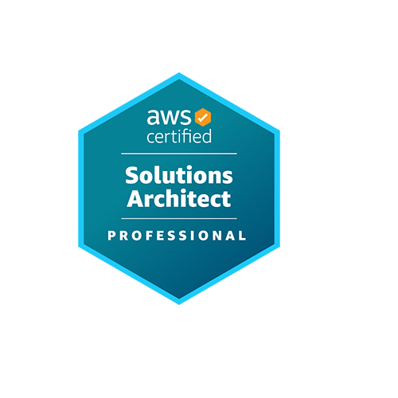
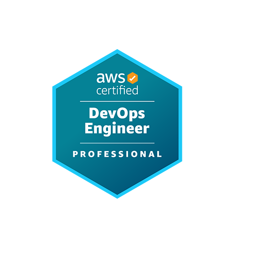
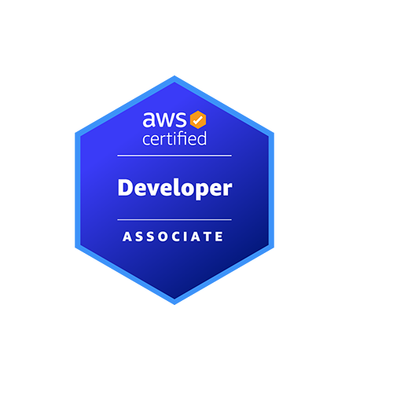
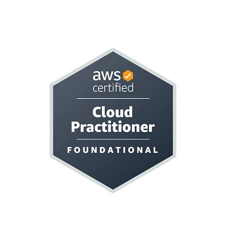

### Hi, I'm Burak — DevOps Team Lead & Cloud Engineer

I'm a **DevOps Team Lead at Skyloop Cloud** with 3+ years of hands-on experience designing, automating, and operating scalable cloud-native infrastructure on AWS. I lead a team of five cloud engineers and have delivered cloud platform work across **100+ customer projects**, with a strong focus on automation, cost efficiency, and developer-enabling infrastructure.

Graduated in **July 2026** from **Bahçeşehir University — Computer Engineering** (full scholarship, 2022–2026), spending the last three years working full time in DevOps alongside my studies.

Currently expanding into **AI-driven platform engineering** — Model Context Protocol (MCP), agentic workflows, and AI tooling integration across cloud infrastructure.

Istanbul, Türkiye

---

### Cloud & Infrastructure

- **AWS** — multi-account architecture, VPC & subnet design, EKS, EC2, Lambda, Route53, ElastiCache Redis, ALB/NLB, WAF, Transit Gateway, Site-to-Site & Client VPN, IAM/IRSA, Fargate, Secrets Manager
- **IaC** — Terraform (modular, multi-environment, remote state), CloudFormation
- **Containers & Orchestration** — Kubernetes, Docker, Helm, Kustomize (base/overlay), HPA, Cluster Autoscaler, Karpenter, RBAC
- **CI/CD** — GitHub Actions, Bitbucket Pipelines (OIDC-based AWS auth, no long-lived keys), AWS native services
- **Platform Tooling** — FluentBit, Telegraf, Stakater Reloader, Secrets Store CSI Driver, SonarQube

---

### Observability Stack

- **Metrics** — kube-prometheus-stack, VictoriaMetrics, Prometheus, CloudWatch
- **Logs** — VictoriaLogs, Grafana Loki, FluentBit
- **Tracing** — OpenTelemetry, Grafana Tempo
- **Dashboards & Alerting** — Grafana as code (HPA status, nginx access logs, pod resources, PHP-FPM metrics, API response codes/times, distributed traces) with custom alerting rules and notification policies

---

### Cost & Governance

- Cost optimization with Cost Explorer & Budgets — EC2 right-sizing, S3 lifecycle policies, CloudWatch log retention limits
- Reserved Instance and Savings Plan strategies, Spot for suitable workloads
- Multi-account tagging strategies for chargeback and per-team / per-project visibility
- AWS Organizations and Service Control Policies (SCPs) for compliance and cost guardrails

---

### Languages & Tools

- **Python**, **Java**, **Bash**
- Terraform, Helm, Kustomize, Docker, Git

---

### Engineering Practices

- Clean Code & Architecture (SOLID, design patterns, maintainability)
- Security — secure coding, secrets management, least-privilege IAM, vulnerability prevention
- Testing — unit/integration testing, TDD, code coverage, load & performance testing
- Observability — structured logging, distributed tracing, performance monitoring
- Team enablement — code reviews, architectural guidance, incident response runbooks

---

### AWS Certifications

<table>
  <tr>
    <td align="center">
      <a href="https://www.credly.com/badges/80ba4458-b85c-4e9d-99d1-e369135a386b" target="_blank">
         
        <b>Solutions Architect – Professional</b> 
        Dec 2025 · Valid until Dec 2028
      </a>
    </td>
    <td align="center">
      <a href="https://www.credly.com/badges/e8df7331-7d7e-4809-92d9-ddb6d38b9978" target="_blank">
         
        <b>DevOps Engineer – Professional</b> 
        Aug 2024 · Valid until Aug 2027
      </a>
    </td>
    <td align="center">
      <a href="https://www.credly.com/badges/ad65a7eb-cbc6-40cd-9dc5-4c6e47e0235d" target="_blank">
         
        <b>Developer – Associate</b> 
        Mar 2024 · Valid until Aug 2027
      </a>
    </td>
    <td align="center">
      <a href="https://www.credly.com/badges/327453a5-8cc5-4838-8a73-c57550a75f3f" target="_blank">
         
        <b>Cloud Practitioner</b> 
        Oct 2023 · Valid until Dec 2028
      </a>
    </td>
  </tr>
</table>

---

### Connect

- LinkedIn: [burakhezerr](https://www.linkedin.com/in/burakhezerr/)
- Email: [25burak.hezer@gmail.com](mailto:25burak.hezer@gmail.com)
